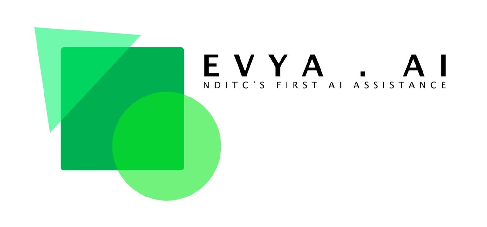

# TinkerHead AI - NDITC ✅
Notre Dame Information Technology Club's official Artificial Intelligence application that performs image recognition, profit prediction and acts as the backend head of the **Tinker** bot.

 

## Tech Stack
 - Python==3.9
 - click==8.1.3
 - colorama==0.4.6
 - comtypes==1.1.14
 - dlib==19.22.99
 - face-recognition==1.3.0
 - face-recognition-models==0.3.0
 - numpy==1.24.1
 - opencv-python==4.7.0.68
 - Pillow==9.4.0
 - pypiwin32==223
 - pyttsx3==2.90
 - pywin32==305

 

## How to use?
- Download the project [zip file](https://codeload.github.com/ahammadshawki8/nditc_ai_app/zip/refs/heads/main?token=ANMOM66HVQJ7ANYUUEGKDVDDXV7SA)
- Install [Python](https://www.python.org/downloads/) 3.9+ version on your device
- Setup the **virtual evnvironment** using [requirements.txt](requirements.txt) file
- Enjoy the application experience

 

## How to contribute?
- Start a new [issue](https://github.com/ahammadshawki8/nditc_ai_app/issues/new)
- Solve an existing [issue](https://github.com/ahammadshawki8/nditc_ai_app/issues)

 

## Credits
- Image Collection - [Arko Chowdhury](https://www.facebook.com/arko.chowdhury.121)
- Face Recognition & GUI - [Mahin Bin Hasan](https://www.facebook.com/root.mahin)
- Profit Prediction - [Nadeef Chowdhury](https://www.facebook.com/nm.c.5283)
- Project Finalization - [Ahammad Shawki](https://linktr.ee/ahammadshawki8/)

 

## Snaps in Action

 

## License
Details can be found in [LICENSE](LICENSE)

 

## Contact Us
- [Telephone](tel:01885-925097)
- [Email](mailto:info@nditc.org)
- [Website](http://nditc.org/)
- [Facebook](https://www.facebook.com/nditc.official)
- [LinkedIn](https://www.linkedin.com/company/nditc/)